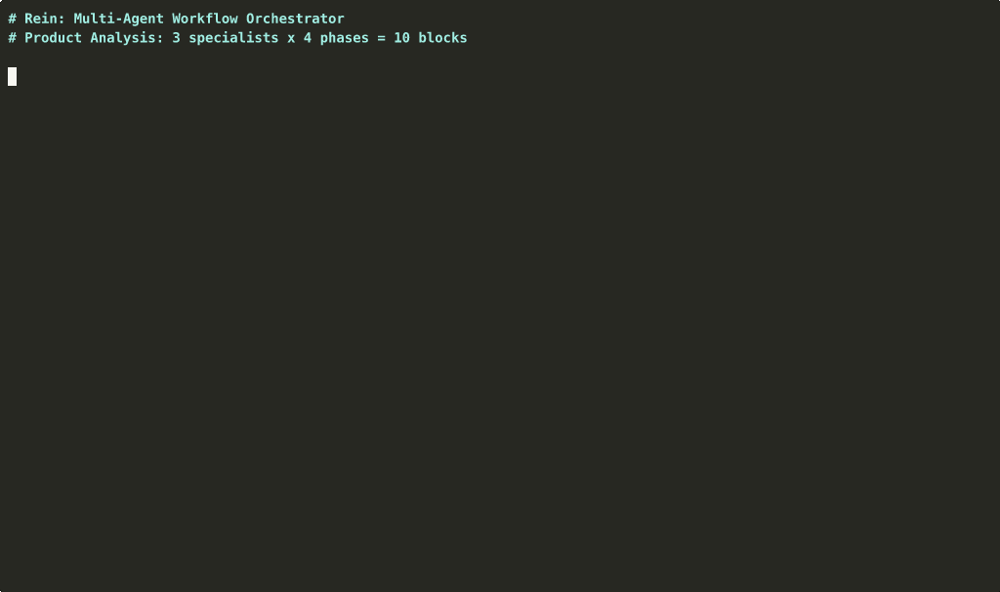

[](LICENSE)
[](https://www.python.org/downloads/)

# Rein

**Give a complex task to a team of AI agents instead of just one.**

Instead of writing a single massive prompt, you break work into steps and assign each step to a specialist -- a researcher, a writer, an editor. Each one gets the previous agent's output automatically. They can work in parallel, loop back for revisions, and make decisions based on results.

You describe *what* should happen in plain text files (YAML + Markdown). Rein figures out the *how* -- launches agents, passes data between them, tracks progress, handles failures.

Works with any LLM: Claude, GPT, Ollama (local/free), OpenRouter (100+ models). No Python code required.

```yaml
# workflow.yaml
provider: anthropic
model: claude-sonnet-4-20250514
team: my-team

blocks:
  - name: research
    specialist: researcher
    prompt: "Analyze this topic: {{ task.input.topic }}"

  - name: write
    specialist: writer
    depends_on: [research]
    prompt: "Write article based on: {{ research.json }}"
```

### Demo: Product Analysis (10 blocks, 4 phases)



*3 specialists (Product Manager, UX Researcher, Business Analyst) analyze a product question through 4 phases: independent analysis, cross-review, synthesis, and final recommendation.*

## Quick Start

```bash
# Install
pip install rein-ai[anthropic]

# Set your API key
export ANTHROPIC_API_KEY=sk-...

# Run the hello-world example
cd examples/01-hello-world
rein --agents-dir ./agents workflow.yaml --no-ui
```

Works with **any LLM**: Anthropic Claude, OpenAI GPT, Ollama local models, OpenRouter.

For a step-by-step tutorial that walks you through creating specialists, teams, and workflows from scratch, see the **[Getting Started Guide](docs/getting-started.md)**.

## How It Works

Rein has a 3-layer architecture -- all defined in text files:

```
Layer 1: SPECIALISTS (Markdown)     What each AI agent does
Layer 2: TEAMS (YAML)               Groups of specialists + shared tone
Layer 3: WORKFLOWS (YAML)           Execution flow with dependencies
```

**Specialist** -- a Markdown file defining an AI agent's role:

```markdown
# Code Reviewer

You are a senior engineer conducting code reviews.

## Output Format
{"verdict": "approve|request_changes", "issues": [...]}
```

**Team** -- a YAML file grouping specialists:

```yaml
name: code-review-team
specialists:
  - code-reviewer
  - code-improver
collaboration_tone: |
  Be constructive and specific. Always output valid JSON.
```

**Workflow** -- a YAML file defining what to execute:

```yaml
blocks:
  - name: review
    specialist: code-reviewer
    prompt: "Review this code: ..."

  - name: improve
    specialist: code-improver
    depends_on: [review]
    prompt: "Fix issues found: {{ review.json }}"
```

## Installation

```bash
# Core (picks provider from environment)
pip install rein-ai

# With specific provider SDK
pip install rein-ai[anthropic]    # Claude
pip install rein-ai[openai]       # GPT-4o
pip install rein-ai[all]          # All provider SDKs

# For daemon mode (WebSocket support)
pip install rein-ai[daemon]

# For MCP server (Claude Desktop, Cursor, Claude Code)
pip install rein-ai[mcp]
```

Or from source:

```bash
git clone https://github.com/rein-orchestrator/rein.git
cd rein
pip install -e ".[dev]"
```

## Provider Configuration

Set your provider in workflow YAML and API key in environment:

```yaml
# Anthropic Claude
provider: anthropic
model: claude-sonnet-4-20250514
```

```yaml
# OpenAI
provider: openai
model: gpt-4o
```

```yaml
# Ollama (local, no API key needed)
provider: ollama
model: llama3.1
```

```yaml
# OpenRouter (100+ models)
provider: openrouter
model: anthropic/claude-sonnet-4-20250514
```

Environment variables:

| Provider | Env Variable | Required |
|----------|-------------|----------|
| anthropic | `ANTHROPIC_API_KEY` | Yes |
| openai | `OPENAI_API_KEY` | Yes |
| ollama | `OLLAMA_URL` | No (default: localhost:11434) |
| openrouter | `OPENROUTER_API_KEY` | Yes |
| gateway | `AI_GATEWAY_URL` or `BRAIN_API_URL` | Yes |

Auto-detection: if no `provider:` is set in YAML, Rein checks environment variables in order: `ANTHROPIC_API_KEY` -> `OPENAI_API_KEY` -> `OPENROUTER_API_KEY` -> `OLLAMA_URL` -> `AI_GATEWAY_URL`.

Copy `.env.example` to `.env` and fill in your preferred provider key:

```bash
cp .env.example .env
```

## Examples

Ten progressive examples in the `examples/` directory:

### Basics (01-05)

| # | Example | Pattern | What you learn |
|---|---------|---------|----------------|
| 01 | [hello-world](examples/01-hello-world/) | 1 specialist | Basics: specialist, team, workflow |
| 02 | [code-review](examples/02-code-review/) | 2 sequential | Dependencies and data flow |
| 03 | [research-team](examples/03-research-team/) | 3 parallel + 1 | Fan-out / fan-in pattern |
| 04 | [deliberation](examples/04-deliberation/) | 3-phase debate | Cross-review and multi-phase |
| 05 | [conditional](examples/05-conditional/) | Branching + loops | if/else, revision loops, max_runs |

### Advanced (06-10)

| # | Example | Pattern | What you learn |
|---|---------|---------|----------------|
| 06 | [product-analysis](examples/06-product-analysis/) | 10 blocks, 4 phases | Multi-role product analysis (PM, UX, Business) |
| 07 | [brainstorm](examples/07-brainstorm/) | 7 blocks, diverge/converge | Divergent ideation + cross-pollination + synthesis |
| 08 | [generic-deliberation](examples/08-generic-deliberation/) | 7 blocks, 3 phases | Creator/Critic/Integrator -- reusable template |
| 09 | [docs-architecture](examples/09-docs-architecture/) | 10 blocks, 4 phases | Architecture review (Architect, API, PM) |
| 10 | [creative-writing](examples/10-creative-writing/) | 5 blocks, sequential | Logic scripts: validate, post-process, enrich |

```bash
# Try any example
cd examples/03-research-team
export ANTHROPIC_API_KEY=sk-...
rein --agents-dir ./agents workflow.yaml --no-ui
```

## CLI Reference

```bash
# Run a workflow file
rein workflow.yaml --agents-dir ./agents

# Run a named flow
rein --flow deliberation --question question.txt

# Run with JSON input
rein --flow my-flow --input '{"topic": "AI trends", "style": "casual"}'

# Check task status
rein --status task-20260113-143022

# Resume a failed run
rein --resume 20260113-143022

# Run without terminal UI
rein workflow.yaml --no-ui

# Daemon mode (watches for tasks)
rein --daemon --agents-dir ./agents
```

All options:

| Option | Description |
|--------|-------------|
| `config` | Path to workflow YAML file |
| `--flow NAME` | Flow name (from agents/flows/) |
| `--question FILE` | Question file path (used with --flow) |
| `--input JSON` | JSON parameters for task.input |
| `--task DIR` | Run existing task directory |
| `--task-dir DIR` | Task directory with task.md (used with --flow) |
| `--status ID` | Show task status |
| `--resume ID` | Resume previous run |
| `--pause` | Start in paused state |
| `--no-ui` | Disable Rich terminal UI |
| `--agents-dir PATH` | Custom agents directory |
| `--daemon` | Run as daemon |
| `--daemon-interval N` | Daemon check interval in seconds (default: 5) |
| `--max-workflows N` | Max parallel workflows in daemon mode (default: 3) |
| `--ws-port PORT` | WebSocket port (default: 8765) |
| `-V, --version` | Show version and exit |

## Directory Structure

```
my-project/
  agents/
    specialists/         # AI agent definitions (Markdown)
      researcher.md
      writer.md
    teams/               # Team configurations (YAML)
      my-team.yaml
    flows/               # Workflow templates (YAML)
      my-flow/
        my-flow.yaml
        logic/           # Optional Python scripts
          pre.py
          post.py
```

When a workflow runs, Rein creates a task directory with isolated block outputs:

```
/tmp/rein-runs/run-20260113-143022/
  state/
    rein.db              # SQLite state (crash recovery)
    rein.log             # Execution log
  research/
    outputs/
      result.json        # Block output
  write/
    outputs/
      result.json
```

## Workflow Features

### Dependencies and Parallelism

Blocks with no dependencies run in parallel. `max_parallel` limits concurrency.

```yaml
max_parallel: 3

blocks:
  - name: a
    prompt: "..."         # Runs immediately

  - name: b
    prompt: "..."         # Runs in parallel with a

  - name: c
    depends_on: [a, b]    # Waits for both a and b
    prompt: "{{ a.json }} {{ b.json }}"
```

### Conditional Branching

Route execution based on block output:

```yaml
- name: gate
  prompt: "Evaluate quality..."
  next:
    - if: "{{ result.approved }}"
      goto: publish
    - else: revision
```

Condition syntax: `{{ result.field }}` (truthy), `{{ result.score > 0.8 }}` (comparison), `{{ result.status == 'done' }}` (equality).

### Revision Loops

Send a block back for re-evaluation with loop protection:

```yaml
- name: revision
  depends_on: [gate]
  max_runs: 3            # Max 3 attempts
  next: gate             # Back to quality check
```

### Logic Scripts

Python scripts for pre/post processing:

```yaml
logic:
  pre: logic/fetch-data.py       # Before LLM: prepare data
  post: logic/save-result.py     # After LLM: process output
  validate: logic/check.py       # Gate: exit code 0 = pass
  custom: true                   # Skip LLM entirely
```

Scripts receive JSON context via stdin:

```json
{
  "output_file": "path/to/result.json",
  "block_dir": "path/to/block/",
  "task_input": {"topic": "..."},
  "task_id": "task-20260102-183805",
  "workflow_dir": "path/to/flow/"
}
```

### Template Variables

Reference previous block outputs and task input in prompts:

```yaml
prompt: |
  Topic: {{ task.input.topic }}
  Research: {{ research.json }}
  Review: {{ review.json }}
```

## Daemon Mode

Run Rein as a background service that watches for tasks:

```bash
rein --daemon --agents-dir ./agents --ws-port 8765
```

The daemon monitors `agents/tasks/` for directories with `state/status = "pending"` and executes them automatically. Live updates are broadcast via WebSocket on the configured port.

For systemd deployment, see `deploy/rein-daemon.service`.

## MCP Server

Rein includes an MCP (Model Context Protocol) server, so you can run workflows directly from Claude Desktop, Cursor, Claude Code, or any MCP-compatible client.

```bash
pip install rein-ai[mcp]
```

### Claude Desktop / Cursor

Add to your `claude_desktop_config.json`:

```json
{
  "mcpServers": {
    "rein": {
      "command": "rein-mcp",
      "env": {
        "ANTHROPIC_API_KEY": "sk-ant-...",
        "REIN_AGENTS_DIR": "/path/to/your/agents"
      }
    }
  }
}
```

### Claude Code

```bash
claude mcp add rein -- rein-mcp
```

### Available Tools

| Tool | Description |
|------|-------------|
| `list_flows` | List available workflows with descriptions and block counts |
| `list_specialists` | List specialists with summaries |
| `list_teams` | List teams and their composition |
| `run_workflow` | Execute a workflow synchronously and return results |
| `create_task` | Create an async task for the daemon |
| `task_status` | Check task progress (block-level detail) |
| `list_tasks` | List recent tasks with status |

The MCP server also supports SSE and streamable-http transports:

```bash
rein-mcp --sse          # SSE transport
rein-mcp --streamable-http  # HTTP streaming
```

## Terminal UI

When running without `--no-ui`, Rein displays an htop-like interface:

- Block name, status (running/done/failed/waiting), progress bar
- Flags: P=parallel, D=deps, L=logic, N=next, R=max_runs
- IN/OUT data sizes, elapsed time

Runtime controls (via stdin): `p` = pause, `r` = resume, `q` = quit.

## Tech Stack

- Python 3.10+
- Rich (terminal UI)
- SQLite (state persistence, crash recovery)
- YAML (workflow definitions)
- Markdown (specialist prompts)

## Contributing

We welcome contributions! Please see [CONTRIBUTING.md](CONTRIBUTING.md) for development setup and guidelines.

For security issues, please see [SECURITY.md](SECURITY.md).

This project follows the [Contributor Covenant Code of Conduct](CODE_OF_CONDUCT.md).

## License

MIT
